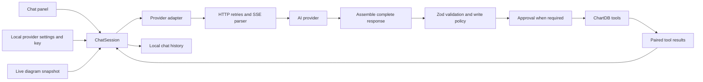

# AI assistant: runtime and reliability review

Reviewed 2026-09-06. The regression suite uses mocked provider responses; it does not establish live account access, CORS availability, or model quality.

## How it works



`AIChatProvider` owns a session for the selected provider, model, and diagram. It supplies current editor state through a getter, subscribes to updates, and aborts/unsubscribes on replacement or unmount. Keys and model settings come from `AIConfigProvider`; these are browser-side, user-supplied credentials.

`ChatSession` builds a fresh prompt and estimates request size before each model round. It trims complete old user turns from the outgoing request, while retaining visible history. The budget includes the system prompt, tool catalog, output allowance, messages, and Gemini metadata. Known model output limits are enforced. An oversized current turn fails explicitly instead of splitting tool calls from their results.

Adapters translate the shared message format to OpenAI Chat Completions, Anthropic Messages, or Gemini Generate Content. DeepSeek and LM Studio reuse the OpenAI-compatible adapter. SSE events are assembled before any tool runs. Tools execute sequentially; results return to the model until it answers or the round limit is reached.

The separate SQL export path uses the installed Vercel AI SDK to translate SQL between database dialects. It uses environment configuration rather than the chat settings. Same-dialect SQL export remains deterministic.

## Findings and fixes

| Failure | Resulting behavior |
| --- | --- |
| Invalid JSON arguments became `{}` | Invalid values reach Zod validation and produce corrective feedback; they cannot become valid empty-argument calls. |
| Truncated streams, token limits, and HTTP-200 stream errors could appear successful | Incomplete responses do not execute tools. The UI reports the failure and retains earlier completed work. |
| Cancellation discarded completed results and left unanswered calls | Every committed call gets a result, including explicit cancellation results for calls not started. Legacy interrupted history is repaired with an unknown-outcome error, never by replaying writes. |
| History pruning and storage caps split tool exchanges | History is cut at user-turn boundaries. Stored messages and usage are validated before loading. |
| Dry-run only instructed the model not to write | Mutating tools are removed from dry-run requests and blocked again at execution. Read-only diagrams also reject writes. |
| Approval depended on individual tool implementations | The session validates arguments and enforces approval once before execution, including batches. It checks cancellation and write policy again after approval. |
| Batch descriptions claimed atomic execution and encouraged invented IDs | Guidance now describes sequential execution without rollback. Create entities first, then use returned IDs in later dependent calls. |
| Batch delete paths bypassed normal validation; failures lost successful results | Deletes reuse the catalog implementation. Failures include the completed operations, returned IDs, and failing index. |
| Batch contexts held old editor snapshots | The context reads the latest diagram for each access and rejects access after navigation/cancellation. |
| Gemini sent array tool results where an object is required | Array results are wrapped in a result object before sending function responses. |
| Gemini discarded opaque thought signatures | Original response parts are retained, persisted, and replayed unchanged; thought text is excluded from visible assistant text. |
| Shared schemas used OpenAPI nullable syntax; Gemini rewrote schema keys | Shared schemas use JSON Schema 7. Gemini uses `parametersJsonSchema`, eliminating the custom schema rewriter. |
| DeepSeek conversion made optional updates required and removed properties named `nullable` | The sanitizer distinguishes schema keywords from property names and preserves optionality; Zod still enforces the original operation schema. |
| No way to discover supported data types | New read-only `list_data_types` returns dialect types and existing custom types. Field tools accept custom type IDs. |
| Indexes, check constraints, and custom types were not actionable | Validated create/update/delete tools now reuse the editor's persisted operations; check expressions use the editor's syntax validator, index methods are checked against the active dialect, and custom type deletion is blocked while fields still reference it. All nine operations are also available in `apply_schema_patch`. |
| Relationship creation required a second update | Relationships are created with their complete properties in one editor mutation. |
| Primary keys could become nullable | Field creation and updates keep primary keys non-nullable. |
| Overview flags and table defaults disagreed with implementation | Overview honors positions and defaults to omitting fields; omitted table color uses the editor default. |
| Transient HTTP failures and stalled reads had no recovery limits | Rejected transient requests receive at most two retries, respecting short `Retry-After` delays. Header waits and inactive streams time out after 120 seconds. Cancellation stops retries and stalled reads. Active long streams are not cut off by a total-duration timeout. |
| Unsupported sampling/token parameters caused provider errors | OpenAI reasoning models omit temperature; newer Claude models omit sampling overrides; LM Studio uses `max_tokens`. |
| Catalog metadata overstated Gemini Pro context and Opus pricing | Gemini 2.5 limits and Claude Opus 4.7 base prices/context were corrected from provider documentation. |
| SQL translation ignored custom endpoints and did not cancel inference | Uses the SDK's `baseURL`, Chat Completions for compatible endpoints, and `abortSignal` in both streaming and non-streaming calls. |

## Provider contract checks

- **OpenAI:** collect streamed function arguments, correlate results by call ID, and disable parallel tool calling for sequential diagram work. Chat Completions remains non-strict: the existing tools distinguish omitted fields from explicit null clearing. Enabling strict mode would require an intentional nullable/optional redesign rather than simply marking every property required. [Official OpenAI function-calling documentation](https://developers.openai.com/api/docs/guides/function-calling).
- **Anthropic:** tool results immediately follow their assistant tool uses, inside user messages, with `is_error` for failures. [Tool result requirements](https://platform.claude.com/docs/en/agents-and-tools/tool-use/handle-tool-calls). Newer Claude models reject non-default temperature; omit it outside known legacy families. [Parameter deprecations](https://platform.claude.com/docs/en/about-claude/model-deprecations). Opus 4.7 base pricing is $5 input/$25 output per million tokens and includes a 1M context window. [Pricing](https://platform.claude.com/docs/en/about-claude/pricing).
- **Gemini:** preserve signed response parts in subsequent function-calling requests. [Thought signatures](https://ai.google.dev/gemini-api/docs/generate-content/thought-signatures). Function declarations accept native JSON Schema via `parametersJsonSchema`. [API reference](https://ai.google.dev/api/generate-content#FunctionDeclaration). Both supported Gemini 2.5 entries have 1,048,576 input and 65,536 output token limits. [Pro](https://ai.google.dev/gemini-api/docs/models/gemini-2.5-pro), [Flash](https://ai.google.dev/gemini-api/docs/models/gemini-2.5-flash).
- **DeepSeek:** the existing integration uses non-thinking, non-strict Chat Completions. Strict mode requires the beta endpoint and a different schema contract; its supported types now include `anyOf`. The conservative compatibility sanitizer remains in place for the existing integration, with optional fields preserved. [Tool-call documentation](https://api-docs.deepseek.com/guides/tool_calls/). Existing V4 model IDs, output limits, and off-peak base rates match the current catalog. [Models and pricing](https://api-docs.deepseek.com/quick_start/pricing/).
- **LM Studio:** Chat Completions supports `max_tokens`; actual tool reliability depends on the loaded model. [Supported request parameters](https://lmstudio.ai/docs/developer/openai-compat/chat-completions).
- **SQL export SDK:** the installed `@ai-sdk/openai` types declare `baseURL` and `.chat()`, and the installed `ai` types declare `abortSignal`. The new export tests check those actual SDK arguments.

## Maintaining tools

1. Define arguments in `schemas.ts` and register the operation through `defineTool` in `tools.ts`. Runtime Zod validation is mandatory even when a provider offers schema enforcement.
2. Explicitly set `readOnly: true` only for tools with no mutations. Unmarked tools are treated as writes. Mark destructive tools and keep the session approval policy consistent with batch contents.
3. Reuse editor mutations so ordinary undo/history/storage behavior applies. Validate referenced IDs first. Return created IDs; never tell the model to invent dependent IDs.
4. For batch operations, use the same implementation as the standalone tool. Check cancellation and write permission between operations and retain partial results on failure.
5. Add a regression case for the real failure boundary. The provider tests exercise the catalog through all five adapters; session tests cover approvals, history, limits, and cancellation. A React lifecycle test covers diagram navigation.
6. Keep prompt examples limited to real available capabilities. Indexes, check constraints, and custom types are supported; SQL execution, shell, and browsing tools remain intentionally out of scope.

## Validation

Final result: 908 tests passed across 118 files; production build and repository-wide lint passed. The build still reports bundle-size warnings.

```sh
npm run build
npm run lint
npx vitest run src/lib/ai src/context/ai-chat-context/__tests__ src/lib/data/sql-export/__tests__/ai-export.test.ts
```

On the installed Node version, native experimental Web Storage shadows Happy DOM's `localStorage`. Run the full suite with:

```sh
NODE_OPTIONS=--no-experimental-webstorage npx vitest run
```

No dependencies were added. Tests use synthetic provider SSE responses and mocked editor mutations, including malformed JSON, missing completion markers, Unicode/chunk boundaries, rate limits, cancellation, partial patches, persisted history, and provider-specific request payloads.

## Practical limits

- No live paid inference was performed. Account permissions, live provider schema acceptance, CORS, local-server availability, and model quality still require a smoke test in the configured environment. The Settings connection test only lists models; it does not validate a tool round trip.
- A batch is not a transaction. Cancellation cannot undo a storage write already in flight; completed changes remain available through the editor's ordinary undo actions. An interrupted persisted call with no recorded outcome must be reconciled by reading the diagram.
- Context sizing is a heuristic, not a provider tokenizer. Unknown custom model limits cannot be inferred from an arbitrary model ID. Cost displays remain estimates; cached-token discounts, long-context tiers, and DeepSeek peak pricing are not fully priced.
- Large diagrams use a summary snapshot and fetch exact fields on demand; the default settings allow 8,192 output tokens and 16 tool rounds. Very large imports should still be staged and reviewed in batches because a batch is sequential rather than transactional.
- Credentials remain within the browser's trust boundary. Locally encrypted values do not protect against code with same-origin access. This review did not replace the application's BYOK configuration or storage architecture.
